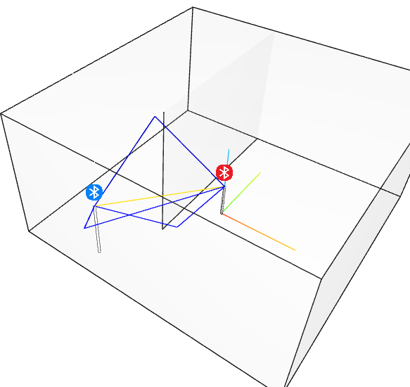
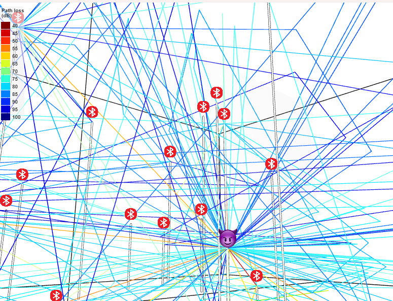
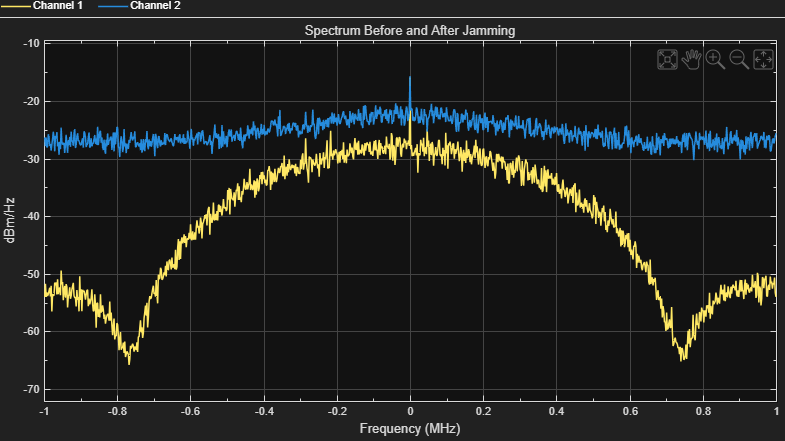
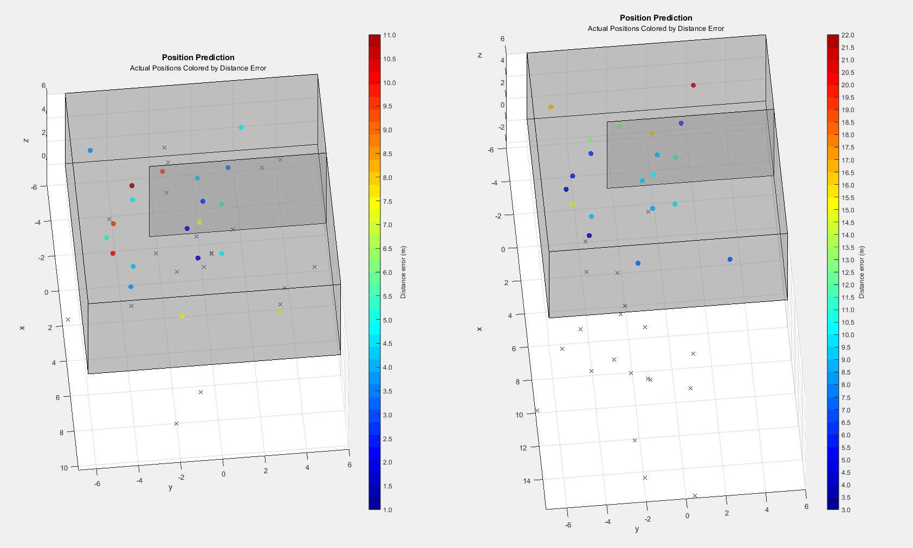

I just made this for my university assignment, a simulation project that analyzes how BLE jamming affects machine learning models trained to process BLE data. Using MATLAB, I built and evaluated models that demonstrate the impact of interference. I will go through the development process of this project in this blog.

[This is the github page of the project.](https://github.com/BurningZilch/BLE-jamming-simulation)

## **Project Overview**

This project was part of my university assessment to:

1. Simulate BLE environments with varying interference.
2. Train and evaluate machine learning models (CNN and RF) using simulated BLE data.

## **Step 1: Planning**

After research, I outlining the key components of the simulation:

1. **BLE Environment**: Simulating BLE signals under normal and jammed conditions.
2. **Dataset Generation**: Creating synthetic data to train machine learning models.
3. **Model Training and Testing**: Using CNN and Random Forest models to analyze the impact of interference.

In order to make this project works, I decide to follow the path of Kent Beck: Make it work, make it right, make it fast.

## **Step 2: Make it Work**

My teammate Eli created a file called `bigeli.stl` as a testing environment—a simple room with one wall. I decided to use **ray tracing** to calculate the **multipath fading model** for path loss. To test this, I placed two BLE devices in the room.  

To build the foundation of this simulation, I modified MATLAB example code and created three main classes:

1. **BLE Device**: Represents the BLE transmitter/receiver.
2. **Connection Channel**: Models the path between devices, including multipath fading.
3. **Waveform**: Simulates the BLE signal waveform for analysis.

At this stage, I simplified the setup to calculate RSSI values **without noise or real-world factors**. This allowed me to save time and focus on presenting preliminary results during our midterm meeting. Using the gathered RSSI values from three beacons, I trained a simple **Random Forests (RF)** machine learning model to predict signal strength.

## **Step 3: Make it Right**

After proving the concept worked, I refined the simulation to make it more realistic:

**Adding Noise and Jamming**:  
   I integrated interference signals into the connection channel to simulate **jamming interference**. This required creating a jammer class that added controlled noise to the BLE waveform.

**Realistic RSSI Calculations**:  
   I updated the RSSI calculations to include real-world factors like environmental noise, signal reflections, and fading. This made the simulation results closer to what BLE devices experience in practice.

**Improved Model Training**:  
   With the updated dataset, I trained a **Convolutional Neural Network (CNN)** in addition to the RF model. The CNN was designed to capture more intricate patterns in the BLE data, making it potentially more resilient to interference. Due to the time limit, the ML model did not works well, but the experiment still shows the potential for affect ML using simulations BLE with jamming interference 

Feel free to comment or reach out with questions—I’d love to hear your thoughts!
