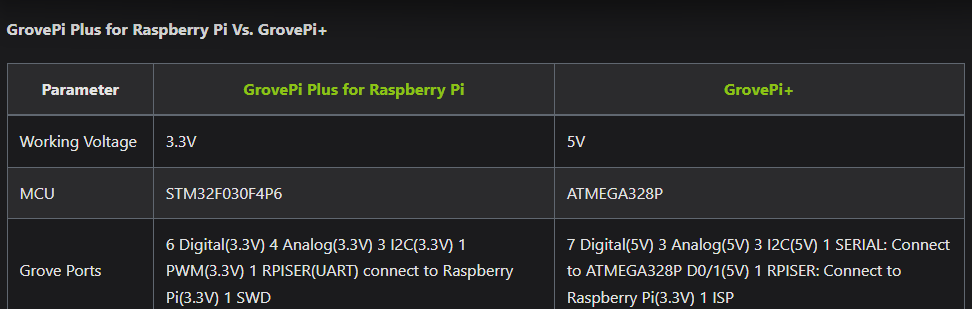
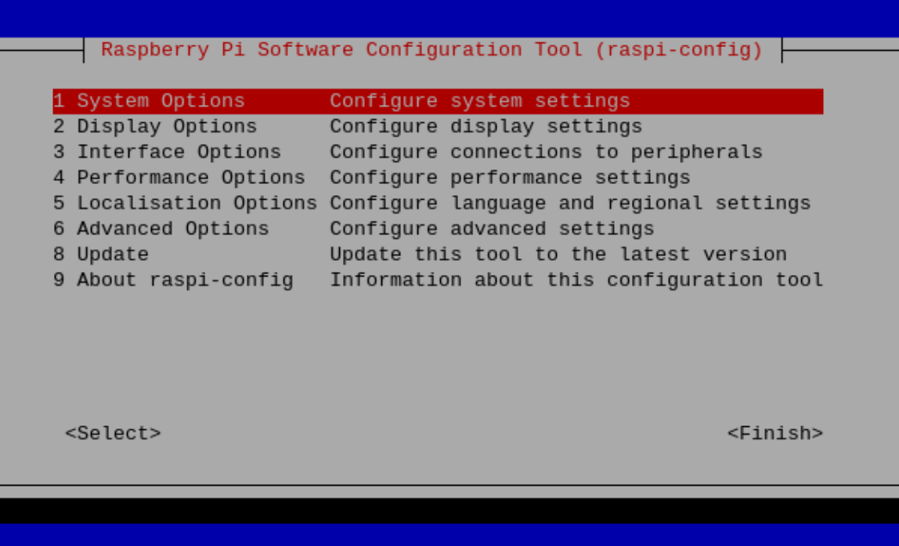
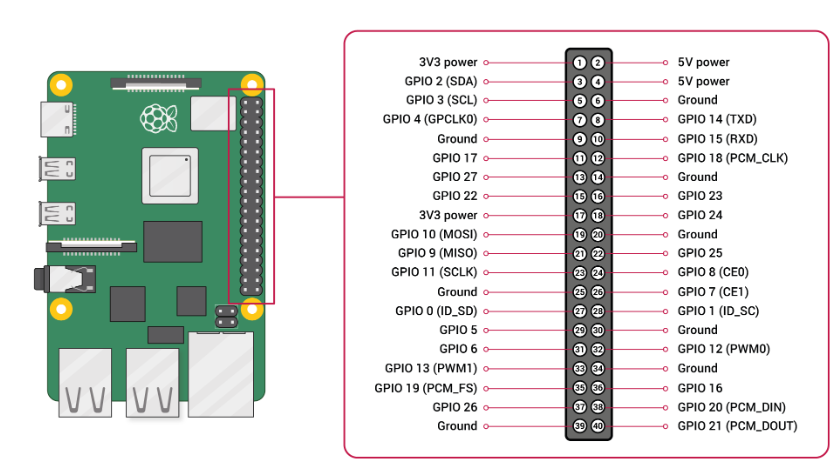
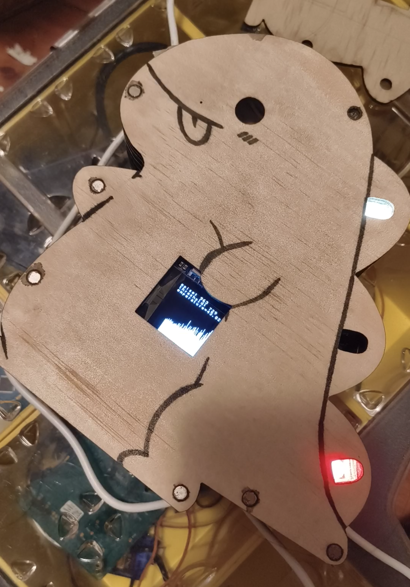

I got a GrovePi+ for my assignment, but it did not go well since the community for this device has not been active since 2021.

After all this suffering, I decided to leave some notes so future generations can learn from my mistakes.

You can find our assignment's info at the end of the page, and [here](https://github.com/BurningZilch/DK-DINO).

**The first mistake I made was choosing to use GrovePi+ without any research. If it's not too late for you, run and never come back. There are many similar products that are still maintained; you can find them on YouTube, Google, and ChatGPT.**

First of all, check this [wiki](https://wiki.seeedstudio.com/GrovePi_Plus/) and make sure your device is the GrovePi+ (the blue one). The official wiki has referred to **another** device as GrovePi Plus for Raspberry Pi (the green one).

# Flash the SD Card
To install the GrovePi+, you need an 8GB+ microSD card and a GrovePi+ plugged into a Raspberry Pi. Because the newest Raspberry Pi system is not compatible with GrovePi+, click this [link to download the newest Buster system](https://downloads.raspberrypi.org/raspios_armhf/images/raspios_armhf-2021-05-28/2021-05-07-raspios-buster-armhf.zip) and flash the microSD card with [RaspberryPi Imager](https://www.raspberrypi.com/software/). Select **Use custom** for the operating system, name the user **pi**, and remember to set up SSH and Wi-Fi if you do not have a monitor for the Raspberry Pi.

# SSH into the Raspberry Pi
I recommend using Termius (free version) for the SSH terminal for the log function, but any terminal will work.

Type **ssh pi@raspberrypi.local** (replace raspberrypi.local with your custom machine name of Raspberry Pi) into your computer's terminal.

Then type **sudo raspi-config**, select **3 Interface Options** to enable features for the Raspberry Pi such as I2C, SPI, VNC, and the camera. You can use VNC Viewer to use the Raspberry Pi with a graphical interface by enabling VNC, setting display options with resolution, and setting boot on GUI with System Options.

# Set Up the Python Environment
Copy this into your Raspberry Pi's terminal and run it (this takes a while):

`sudo apt update -o APT::Get::List-Cleanup="0" -o APT::Get::Changelog="none" ; sudo apt upgrade -o APT::Get::Changelog="none" -y ; sudo apt install vim -y ; sudo pip install pycparser python-periphery tornado qrcode ; sudo curl -kL dexterindustries.com/update_grovepi | bash ; cd ~ ; git clone https://github.com/Seeed-Studio/grove.py ; cd grove.py ; sudo ./install.sh ; cd ~ ;`

# Try Sample Code
After the Python environment has been set up, you should be able to find two folders named "DexterInd" and "grove.py" with the **ls** command. You can find sample code in both folders, but with different code and libraries, make sure you try both. If both sets of sample code do not work or do not exist, try Googling it or using the GPIO port and searching for the GPIO code for that component.

# Write Code for Yourself
You are almost ready to go. One last thing I would like to mention:

**When threads are used, the fewer components interacting at the same time, the better, to reduce bugs caused by noise, especially for I2C devices.**

By the way, this is my project with the GrovePi+.

Thank you for reading, feel free to leave a comment at the bottom of the page.
[Click here to check my project](https://github.com/BurningZilch/DK-DINO).

