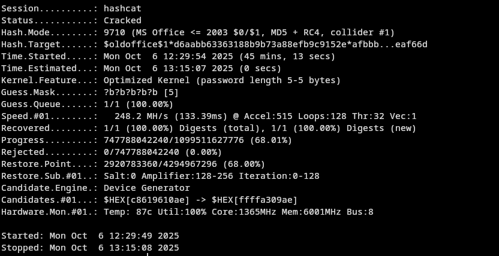

I recently needed to **recover the password for my friend's own old Word 2003 document (.doc)**. It turned into a mini forensics project and a reminder that legacy formats behave very differently from today’s .docx files.

During my reasearch, the [Hashcat forum thread on colliding Office 97–2003 passwords](https://hashcat.net/forum/thread-3665.html) was incredibly helpful, most of this post is just the summary of this thread. Huge thanks to the people who shares knowledge.

This post documents what I learned, with a focus on **ethics, safety, and high-level process**—not copy-paste commands.

> **Important:** Only attempt password recovery on files you **own or are explicitly authorized** to access. Unauthorized access is illegal. This post avoids step-by-step cracking instructions and keeps things high-level for responsible use.

# Dictionary attack

It is the cheapest way to do the job, worth to try it. You can find many different wordlist by searching on github for keywords like **dictionary-attack, wordlist, or brute-force** etc. 

For my case, it didn't work, that is when I start the research, since the world 2003 is 22 years ago, there must be some glitch, right?

# How .doc works with password (CryptoAPI RC4)

The file can not store the password into plain words, it generate a hash from the password and store it into the file, this process is known as Key Derivation Function(KDF)

Old **.doc** files (Word 97–2003) use a CryptoAPI-based scheme that derives an **RC4 key** from your password using **MD5** and a 16-byte random salt. The document also stores two values for checking a candidate password: **EncryptedVerifier** and **EncryptedVerifierHash**. Here’s the high-level flow:

1) **Start from the password (as Unicode).**  
   Compute `MD5(password)`, then keep only the **first 5 bytes** of that hash. This 5-byte slice is used repeatedly below. 

2) **Mix in the 16-byte salt.**  
   Build a 336-byte buffer by repeating **(5-byte truncated hash + 16-byte salt)** exactly 16 times. MD5 that 336-byte buffer to get a new hash. Again take the **first 5 bytes**. 

3) **Fold in a 4-byte “block number.”**  
   Concatenate those 5 bytes with a 4-byte block index (for the password check it’s block `0x00000000`), then MD5 the 9 bytes. The **first 128 bits** of that MD5 become the **RC4 key**. 

4) **Verify the password without decrypting the whole file.**  
   Using that RC4 key (block 0), decrypt the document’s **EncryptedVerifier** and then, **without resetting the RC4 stream**, decrypt **EncryptedVerifierHash**. MD5 the decrypted verifier and compare it to the decrypted verifier hash; if they match, the password is correct. 

### Why this matters

- This design leans on **MD5** and a very short **5-byte truncation step** inside the derivation, which is why legacy .doc protection is considered weak by today’s standards. 
- By contrast, **Office 2007+** moved to **AES** with slower, iterated key-stretching, which raises the work factor for guessing.

# Get the hash value
  I have used john the ripper for getting hash from the file. The command will looks like this:
  
  ```
  office2john DocOld2010.doc
  ```
  the result will be something like
  ```
  DocOld2010.doc:$oldoffice$1*d6aabb63363188b9b73a88efb9c9152e*afbbb9254764273f8f4fad9a5d82981f*6f09fd2eafc4ade522b5f2bee0eaf66d:::::DocOld2010.doc
  ```
  The hash value in this example is 
  ```
  $oldoffice$1*d6aabb63363188b9b73a88efb9c9152e*afbbb9254764273f8f4fad9a5d82981f*6f09fd2eafc4ade522b5f2bee0eaf66d
  ```
  
  Copy the hash value of target file into a file called hash
  
## Exploitation (conceptual): meet-in-the-middle on the legacy KDF

After understanding the legacy KDF (see the section above), the key insight is that you don’t have to re-do the **RC4 verification dance** for every single password guess. Instead, you can split the work in two:

1) **Phase A — Precompute the “intermediate” (one-time):**  
   Search a fixed **intermediate state space** tied to the file (think: the state after the KDF’s mixing but before the per-guess password bits are applied). When you find an intermediate that decrypts the **EncryptedVerifier**/**EncryptedVerifierHash** pair correctly, you’ve essentially learned the **RC4 verification key** for this document. From then on, you **never** need to perform the RC4 verifier check again for each guess—you can just compare against this pre-cracked intermediate.

2) **Phase B — Fast candidate testing (many times):**  
   For each candidate password, you now only compute the **early KDF steps** (up to the 5-byte digest portion) and **compare** that 5-byte result to your stored intermediate. If it matches, that candidate maps to the same key (and you can, if you care forensically, continue to narrow down the *exact* original password).  
   Practically, this means you avoid running RC4—**which is not very GPU-friendly**—on every guess.

> **Why this helps:** RC4 doesn’t vectorize nicely on GPUs, so eliminating it from the inner loop gives a big speedup. You pay a one-time fee up front (Phase A), and then Phase B becomes much cheaper per guess.

### Two modes (how people structure the workflow)
- **Mode 1 (one-time precompute):** Exhaust the intermediate space once for the document until the verifier check passes, then **save** that intermediate.
- **Mode 2 (normal attacks, but faster):** Use your saved intermediate so that each new candidate only needs **KDF steps 1–5**, followed by a **5-byte comparison**, not a full RC4 verify. In this mode you can run any attack strategy you want (rules, combinators, masks, etc.) while keeping the loop light.

### Historical performance notes
On older hardware (e.g., a single **HD7970** GPU), the **hashcat** author reported roughly:
- Baseline (full RC4 verify in the loop): around **~65 MH/s**  
- **Mode 1** precompute over the intermediate space: about **~80 MH/s**, finishing within **a few hours**  
- **Mode 2** (RC4-free inner loop): about **~390 MH/s** with a prototype kernel  

Those numbers are **from an old forum post** and mainly illustrate the *relative* speedup once RC4 is removed from the tight loop—not a promise of modern performance on today’s GPUs.

> Credit: I learned this approach—and the historical performance context—from the classic hashcat forum discussion on **colliding password-protected MS Office 97–2003 documents**. It explains why the legacy RC4/MD5 design enables this meet-in-the-middle style optimization and why it doesn’t apply to modern **.docx** (AES-based, iterated KDF).

# Start Cracking

I have used an old NVIDIA 3050 laptop as GPU and my file tooks me about 6 hours in total to get the password, while this example only need about 1 hour, please make sure if you have enough time, GPU, and luck for this. 

I have used this for get the intermediate

```
hashcat -m 9710 hash -a 3 -w 3 ?b?b?b?b?b -o hash.rc4
```
After about 45 minutes, a hash.rc4 file will be generated, which contains the intermediate.



Then use this to perfume the attack on it

```
./oclHashcat64.bin -m 9720 hash.rc4 -a 3 -w 3 ?a?a?a?a?a?a
```

If unlucky, add one more ?a to brute force with more characters.


After you got this, you can enter the result to the word document and check your old document! In this example, the password is zvDtu!

Noticed this is not the original password, but it will get the same result with the hash so the word document will accecpt it. If you wish for more result (which might contains the original password), you may try this command

```
./oclHashcat64.bin -m 9720 hash.rc4 -a 3 -w 3 ?a?a?a?a?a?a --keep-guessing
```

Thanks for reading—feel free to leave a comment!

