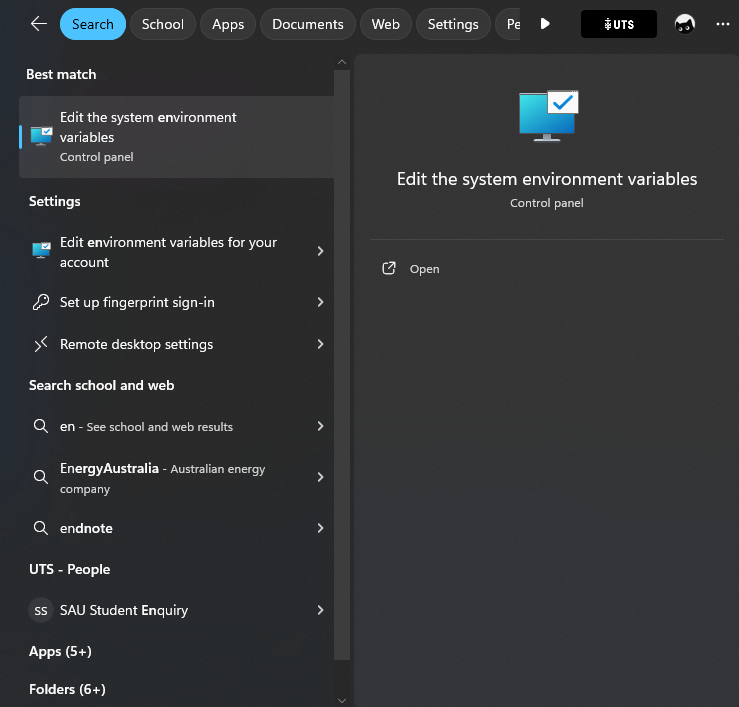
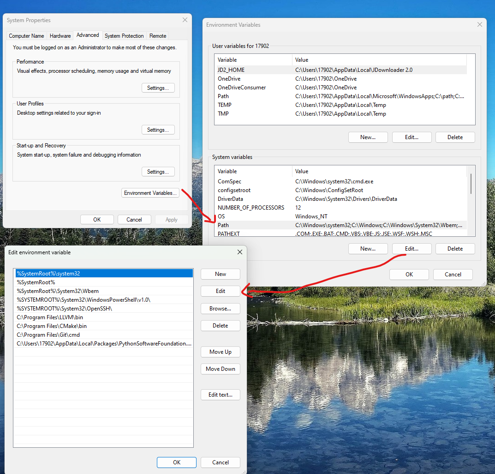

You-get is a powerful tool to download video from website such as Youtube, Bilibili, etc. I use this to share video to my friends so they do not have to download their app.

[yt-dlp](https://github.com/yt-dlp/yt-dlp) is another video downloader which is still updating till 2024, it is more recommend for larger video. I do believe yt-dlp have similar setup step with you-get.

Most of command for installing and using yt-dlp and you-get is same, in this article, I will focus on you-get.

Before you start, you should have python >= 3.74 and ffmpeg install on your machine

# Install in Windows
**update** now [yt-dlp](https://github.com/yt-dlp/yt-dlp) have a stand alone exe file for windows, you can download it and put it in your path rather than using pip
Press **win+r** and type cmd to open Terminal, then type **pip install you-get**, then set up path by search environment variable

Then click Environment Variables button, edit Path in System variable if you want to install for all user, edit Path in User variables if you jusut want to install it for youself
At the new window pops up, select New to put the path of python script downloaded by pi in there, it will be something looks like this:
`C:\Users\17902\AppData\Local\Packages\PythonSoftwareFoundation.Python.3.12_qbz5n2kfra8p0\LocalCache\local-packages\Python312\Scripts`

restart the terminal, the you-get is ready to go.
# Install in Linux
First, clone the repository it from github in linux terminal 
`git clone https://github.com/soimort/you-get`

Then make it PATH by editing the bashrc file
`vim ~/.bashrc`

At the end of the file, add
`export PATH="$PATH:/home/ash/you-get"`
change /home/ash/you-get to your own path to the repository

Then apply the change with
'source ~/.bashrc'

the you-get is ready to go.

# Download video from Youtube 
In your terminal, type `you-get https://www.youtube.com/watch?v=--9kqhzQ-8Q` to download any video with an url in current location.

you can also use -o to setup download path and -O to setup download name
`you-get -o ~/Videos -O goodsong 'https://www.youtube.com/watch?v=--9kqhzQ-8Q'`

This command will download the video into a folder called Videos in home directory and name it goodsong.mp4

# Enjoy
Enjoy your you-get, you can check for more function usch as proxy in [you-get github page](https://github.com/soimort/you-get)

[yt-dlp](https://github.com/yt-dlp/yt-dlp) is another video downloader which is still updating till 2024, it is more recommend for larger video. I do believe yt-dlp have similar setup step with you-get 

Feel free to leave a comment.

