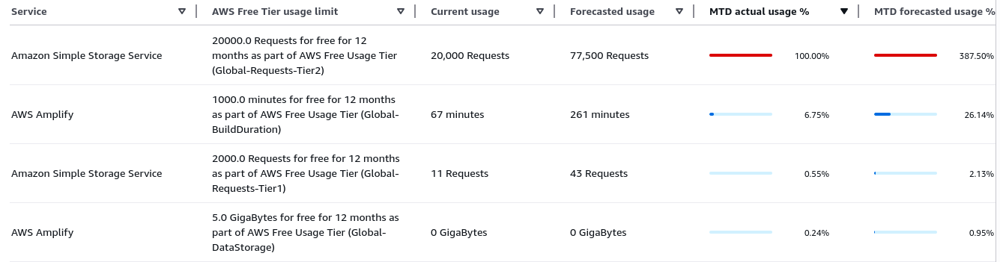

> Drag the map, zoom, and scrub the year slider to explore temperature anomalies (°C).

{/* WeatherMap temporarily disabled until Nov 1, 2025 */}
import WeatherMap from '../../components/WeatherMap.svelte';

  <h2>Temporary Notice (October 8, 2025)</h2>
  

    Our data backend has reached its traffic limits, so the interactive Weather Map is temporarily paused.
    I am currently optimizing query logic and caching to make the dataset more sustainable under load.
  

  

    Please check back on <strong>November 1, 2025</strong>. Thank you for your patience!
  

  

    
Why is this happening?

    

      The underlying API (used by the map tiles) exceeded the available quota. We’re reducing redundant
      requests, tightening server-side caching, and adding client-side deduplication to stretch the bandwidth.
    

  

{/*

  <WeatherMap client:load minHeight="min(80vh, 900px)" />

*/}
